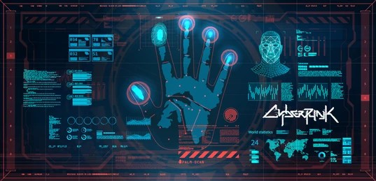
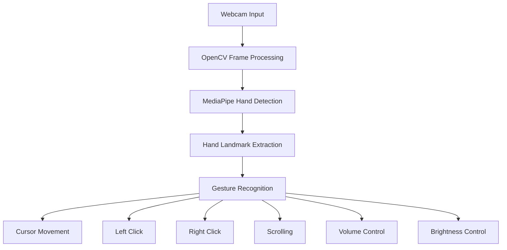
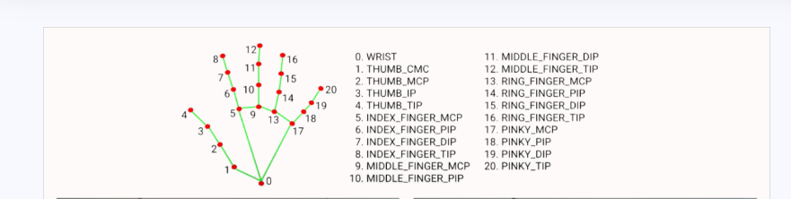

<p align="center">
  
</p>

<h1 align="center">
ROBUST CURSOR INTERFACE BASED ON HAND GESTURE
</h1>

<p align="center">
  A Touchless Human-Computer Interaction System Powered by Computer Vision
</p>

<p align="center">

   

</p>

---

## 📚 Table of Contents

- [Overview](#overview)
- [Features](#features)
- [Technology Stack](#technology-stack)
- [System Architecture](#system-architecture)
- [Installation](#installation)
- [Supported Gestures](#supported-gestures)
- [Screenshots](#screenshots)
- [Performance Highlights](#performance-highlights)
- [Roadmap](#roadmap)
- [Future Scope](#future-scope)
- [Project Structure](#project-structure)

---
<div id="overview">

## 📖 Overview

The **Robust Cursor Interface Based on Hand Gesture** is a real-time Human-Computer Interaction (HCI) system that enables users to control their computer using natural hand gestures captured through a standard webcam.

Built with **Python 3.10**, **OpenCV**, and **MediaPipe**, the system performs real-time hand landmark detection and gesture recognition to execute various computer actions such as:

- Cursor Movement
- Left Click
- Right Click
- Scrolling
- Volume Control
- Brightness Control

The project eliminates the need for conventional input devices and serves as a stepping stone toward future touchless and holographic interaction technologies.
</div>

---

<div id="features">

## ✨ Features

- 🖱️ Real-Time Cursor Control
- 👆 Gesture-Based Left Click
- 👉 Gesture-Based Right Click
- 📜 Gesture-Based Scrolling
- 🔊 Volume Control
- 💡 Brightness Control
- 📹 Webcam-Only Implementation
- ⚡ Low-Latency Processing
- 🎯 High-Accuracy Detection
- 🔄 Gesture Smoothing

</div>

---

<div id="technology-stack">

## 🛠️ Technology Stack

| Technology  |         Purpose           |
|-------------|---------------------------|
| Python 3.10 | Core Programming Language |
| OpenCV      | Computer Vision           |
| MediaPipe   | Hand Tracking             |
| PyAutoGUI   | Mouse Automation          |
| NumPy       | Numerical Processing      |
| Webcam      | Input Device              |


</div>

---

<div id="system-architecture">

## ⚙️ System Architecture



</div>

---

<div id="installation">

## 🚀 Installation

### Clone Repository

```bash
git clone https://github.com/RAHUL-527/Robust-Cursor-Interface-based-on-Hand-Gesture.git
```

### Move into Project Directory

```bash
cd Robust-Cursor-Interface-based-on-Hand-Gesture
```

### Install Dependencies

```bash
pip install -r requirements.txt
```

### Run the Application

```bash
python cursor.py
```

</div>

---

<div id="supported-gestures">

## 🎮 Supported Gestures

|          Gesture              |      Action      |
|-------------------------------|------------------|
| Middle Finger MCP             | Cursor Movement  |
| Thumb Tip & Index Tip         | Left Click       |
| Thumb Tip & Index Finger MCP  | Scroll Down      |
| Thumb Tip & Pinky MCP         | Scroll Up        |
| Thumb Tip & Ring Finger Tip   | Volume 100%      |
| Thumb Tip & Pinky Pip         | Volume 50%       |
| Thumb Tip & Pinky Tip         | Volume 20%       |
| Thumb Tip & Index Finger Pip  | Right Click      |
| Index Tip & Middle Finger Tip | Exit             |
| Two Thumb fingers distance    | Brightness Level |

</div>

---

<div id="screenshots">

## 📸 Screenshots

### Hand Landmark Detection



</div>

---

<div id="performance-highlights">

## ⚡ Performance Highlights

- Real-Time Hand Tracking
- Smooth Cursor Navigation
- High Landmark Detection Accuracy
- Low Latency Interaction
- Stable Gesture Recognition
- Lightweight and Efficient
- No Additional Hardware Required

</div>

---

<div id="roadmap">

## 🛣️ Roadmap

### Current Features

- [x] Cursor Control
- [x] Left Click
- [x] Right Click
- [x] Scrolling
- [x] Volume Control
- [x] Brightness Control

### Upcoming Features

- [ ] Multi-Hand Tracking
- [ ] Gesture Customization
- [ ] AI Gesture Learning
- [ ] Voice + Gesture Fusion

</div>

---

<div id="future-scope">

## Future Scope

This project's concept serves as a foundation for:

- Augmented Reality (AR)
- Mixed Reality (MR)
- Virtual Reality (VR)
- Spatial Computing
- Holographic User Interfaces
- AI-Powered Gesture Recognition

Gesture-controlled interfaces have the potential to replace conventional input devices in next-generation computing environments.

</div>

---

<div id="project-structure">

## 📂 Project Structure

```text
Robust-Cursor-Interface-based-on-Hand-Gesture/
│
├── assets/
│   ├── Mediapipe_code.png
│   ├── hand.png
│
├── CURSOR.py
│
├── requirements.txt
└── README.md
```

</div>

---

<p align="center">
⭐ If you found this project useful, consider giving it a star!
</p>
